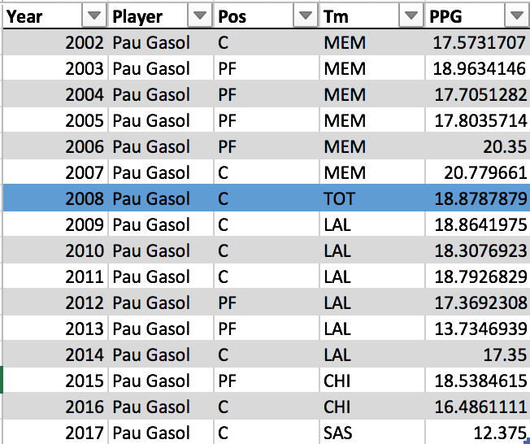

# NBA-Rookie-Analytics
Machine learning model to predict rookie success with one vs two seasons cost analysis.
## 
Project written by:
## 
*David Ramón Prados, Julia Scott, Spencer Sprawson*
## 
**University of Waterloo, ON, Cananda**

## 

## Abstract

The goal of this paper was to compare the accuracy of predicting National Basketball Association (NBA) rookie players’ careers using one year of rookie data versus two years of rookie data. There were three datasets used that all included the same 46 statistics for each player. The datasets were: players from 1982 to 2017 who played for 10 years or more; first season statistics for every rookie in the NBA from 1982 to 2017; and first and second season statistics for every rookie in the NBA from 1982 to 2017\. Supervised and unsupervised machine learning methods were combined in a new way to create a process that included: Principal Component Analysis (PCA), K-means clustering, hierarchical clustering, Linear Discriminant Analysis (LDA), and supervised prediction. The results assigned each rookie to one of the 6 career classifications generated from K-means clustering, defining the predicted role of the player. When using the K-means clusters to make predictions about player roles, using two years of rookie data provides the highest accuracy at 69.72%. This process was repeated for hierarchical clustering with complete linkage to generate 5 career classifications. Using the complete linkage clusters allows for predicting whether a player will be an MVP. Using only one year of rookie data generated predictions with 85.40% accuracy, while using two years of rookie data generated predictions with 86.28% accuracy. In this case, one year of rookie data provided sufficient accuracy in predicting rookie careers. 

Keywords: NBA rookies, PCA, K-means,  hierarchical clustering, LDA, supervised classification.

## 

## 1.0 Introduction

### 1.1 Background Information

James Naismith, a physical education professor at Young Men's Christian Association Training School (YMCA) in Springfield, Massachusetts, invented the game of basketball in 1891 [1]. Since then, basketball has drastically increased in popularity and gone through many changes before becoming the current game known and played all over the world. The National Basketball Association (NBA) was founded in 1946 [2] and is the most well known league in the world today. In 2017, 20.4 million people worldwide watched the NBA final game [3].

The money seen and exchanged in the NBA has grown with it’s renown. The highest paid player in the 2019/2020 NBA season was Stephen Curry making $43 million dollars [4] and the highest paid coach was Greg Popovich making an average of $11 million [5]. Coaches have an invested interest in predicting the future success of rookies because the coaches most successful at creating winning teams are paid the most. Among many other stakeholders in the business of basketball with an interest in player predictions are agents. An agent’s salary is proportional to their client’s salary. As such, agents want to know which rookies are likely to be successful so they know who to represent. These are only a couple of the many parties interested in accurate player prediction.

### 1.2 Business Problem

In relation, the business problem of this report aims to determine if waiting an extra year to predict rookie success based on 2 years of data is worth the increased prediction accuracy. Should coaches, agents, and other stakeholders hold off on making decisions until they have additional information or does 1 years worth of rookie data provide significant enough accuracy? This project completes the player career prediction using first year rookie data, then again using first and second year rookie data and compares the accuracy of the results. The hypothesis was that the additional accuracy in prediction would not be worth the lost money and time waiting an entire extra year and possibly losing out on the better rookies by holding off on making decisions.

### 1.3 Process

To predict rookie careers, this project follows a new process that combines unsupervised and supervised machine learning methods for classification and prediction. Existing studies are either concerned with the classification problem or the prediction problem using already existing features such as salaries, points per game, or win shares. For example, the study “NBA Player Clustering: Exploring Player Archetypes in a Changing NBA” focuses only on clustering the players [6]. However, what is interesting is that none could be found that had combined the classification methods and then used the results to predict NBA rookie careers as proposed in this report.

The data was from the official NBA website, but was taken from Kaggle [7] where it was previously organized in a manner benefiting the required use for this project. There are many different statistics recorded for basketball players including points per game (PPG) and 3-pointers per game (3PPG) among others. The data included 459 players and 46 features (see Appendix A for full list of features). Association rule mining was not used because of this large number of features that were numerical, not categorical. Rules in the ‘if-then’ format would not fit the data well. Instead, a correlation matrix of the features was generated to determine association. The correlation matrix showed that each feature was correlated in some way to other features. As such, no features were dropped in the data exploration stage of the process.

The 46 features were the explanatory variables, and they were used to generate the player career classes that acted as predicted variables. PCA is an unsupervised machine learning technique used to reduce the dimensionality of the data [8]. It took the 46 existing features, and created 4 new features called Principal Components (PCs). The PCs were generated by considering all players’ career data and determining the most efficient way to group the features together. With this method there was no data lost because all features were taken into account and used in the new PCs. The four PCs were: all time greatest players, traditional big men, elite catch and shoot, and elite defenders.

The next step in the process was clustering. Clustering was used to assign each player to one of the newly generated PCs based on their career data. In order to determine the best possible clusters, both K-means and hierarchical clustering methods were implemented. For K-means clustering, k random ‘cluster centroids’ were created and each data point was assigned to the centroid it was closest to, creating k clusters. The centroids were then moved to the center of their clusters and the distances to each point were re-calculated. This was iterated until all data points were assigned to one of 6 clusters: average big man, MVP caliber guard, MVP caliber big man, defensive specialist, elite scorer, and 3&D role player.

For hierarchical clustering using the bottom-up approach, each player was assigned to their own cluster. The distances between clusters were computed and the clusters were grouped together accordingly. This was iterated until one cluster was created and the results displayed in a dendrogram. The single linkage, complete linkage, average linkage, and ward linkage techniques for calculating distance between clusters were implemented. Complete linkage displayed the most useful clusters and resulted in a total of 5 clusters: all time guards, all time big men, all time defensive specialists, all time 3-point shooters, and role players. The clusters represent the different classifications of players’ careers that will be predicted about the rookies.

Once the classifications to be predicted had been generated, a Linear Discriminant Analysis (LDA) supervised machine learning method was performed. LDA is another dimension reduction technique [9]. It uses the desired predicted variable (label) as a target to reduce the features efficiently. In this project, it used the previously generated player career classifications as a target to efficiently reduce the 46 original features to features based on one year of rookie data, then 2 years of rookie data. An LDA using the K-means clusters returned 5 features while using the complete linkage clusters returned 4 features. These new features are the finalized explanatory variables.

### 1.4 Results

Finally, a decision tree classification algorithm was used to assign each rookie to a predicted career classification. Using the K-means clusters allows for predictions about player roles. Using two years of rookie data provides the highest accuracy at 69.72%. Using the complete linkage clusters allows for predicting whether a player will be an MVP. Using only one year of rookie data generated predictions with 85.40% accuracy, while using two years of rookie data generated predictions with 86.28% accuracy. Predicting player roles with K-means using one year of rookie data did not provide sufficient accuracy, but predicting potential MVPs with complete linkage using only one year of rookie data provided almost the same accuracy as two years of data. 

## 2.0 Related Work

The NBA is a multi-billion dollar industry, even earning as much as “$8.3 billion for the 2019-20 season amid losses because of the coronavirus pandemic” [10]. There are many people in the industry who have significant reason to be extremely invested in the success of the players and, consequently, their statistics and predicted statistics. As a result, there have been numerous studies over the years using machine learning on NBA statistics to predict any number of things from the outcome of games to players’ seasons or players’ careers.

Two existing studies found both had the purpose of redefining NBA player classifications. The first study, “Defining NBA players by role with K-means clustering” [11], used Principal Component Analysis (PCA) to reduce the dimensionality of the data, and K-means clustering to determine 12 new role classifications for NBA players. The second study, “Redefining NBA Player Classifications using Clustering” [12], also used Principal Component Analysis (PCA) to reduce the dimensionality of the data, but used hierarchical clustering to determine 8 new role classifications for NBA players instead of K-means. Each cluster described a certain type of player such as “Elite All-Stars” or “Decent Ball-Handlers” [12].

This project uses the same unsupervised machine learning methods: PCA and clustering. Both K-means and hierarchical clustering with single, complete, average, and ward linkage were implemented. K-means clustering and hierarchical clustering with complete linkage were used to make the predictions Instead of concluding with the newly defined NBA player groups by clustering, this project continues on to use supervised machine learning methods to predict rookie NBA player classifications. The predictions are made using rookie’s first year data and then both first and second year data in order to determine the difference in accuracy between the two methods.

Two other studies were found that also extended the unsupervised learning results by using supervised learning methods to predict the NBA career of rookies. The first study, “Predicting Career Paths of NBA Players” [13], predicted a player’s 7 year career path using the first 3 years of their NBA career. Instead of taking lots of features and using PCA to reduce the dimensionality of the data, the study used just one feature: an approximation of player skill based on weighted statistics. The study then used K-means clustering because it was able to get accurate clusters as a result of only having one explanatory variable. A Support Vector Machine (SVM) supervised learning model then classified the players by cluster. The study had the same idea of using unsupervised and supervised methods to predict new NBA players careers, but followed a different process and used different techniques than this project.

The second study, “Predicting NBA Career Performance Based On Rookie Season” [9], predicts a player’s career win shares per season based on their rookie statistics. The study defines win shares as the number of wins attributable to a player. A Linear Discriminant Analysis (LDA) was used to determine features indicative of rookie win shares and normalized career win shares. The features selected were used in various clustering methods including K-means, Gaussian Mixture Model (GMM), DBSCAN, and hierarchical clustering. After the 2 clusters were selected, supervised learning methods, including Exploratory Data Analysis (EDA) and regression, were used to predict the career win shares of a player using their rookie data.

All of the existing studies discussed are similar in idea or process to this project, but this project follows a slightly varied process that is as yet unprecedented. Some of the existing studies found used PCA and clustering on many features to generate player classifications. Other studies used the desired predicted variable with LDA to determine features predictive of the desired variable. This project uses a combination of both methods. Starting with all of the player statistics variables like points per game (PPG) and 3-pointers per game (3PPG), a PCA was performed to create principal components (PCs) that take into account all player features. The players were clustered based on the PCs into player classification categories. Then, an LDA was used as a dimension reduction technique to determine the features that were predictive of the previously defined player classification categories. Those features were used to classify each of the rookie players into PCs.

The same process was applied using only first year rookie data, as well as first and second year rookie data. This project was not complete after the rookie predictions like all of the existing studies found. The purpose of this project was to determine the difference in predicted classification accuracy of the two data sets: first year data, and first and second year data. The goal was to enable relevant individuals in the NBA industry to complete a cost analysis to determine if the benefits outweigh the costs of waiting an extra year to make more informed decisions about rookie players. Thus, this project went into greater detail and is potentially more beneficial to certain individuals, such as coaches and agents, in making decisions about rookies.

## 3.0 Data

The dataset used was from Kaggle [7] and included all NBA player aggregated season stats from 1950 to 2017\. This dataset had some discrepancies including scattered asterisks in player names and missing stats in some places, especially for seasons before 1982\. In order to clean up the player names, a regex filter was run on the data to remove all asterisk characters from the strings. To account for missing statistics, all entries before 1982 were dropped from the dataset. Figure 1 showcases the correlation matrix of the original dataset after these transformations.

Figure 1: Original Dataset Correlation Matrix.

In Figure 1, it is evident that a lot of features are highly positively correlated with each other. For example, 2 pointers (2P) and 2 pointer attempts (2PA) have a strong correlation. From quantitative analysis features were categorized into offensive stats, defensive stats, and advanced stats. An interesting observation was that 3 point statistics such as 3P%, 3PA, and 3P were not highly correlated with field goal percentage (FG%) or points (PTS). This shows that there is a distinction between 3P offensive players and 2P offensive players.

The original dataset was transformed from season totals to per game averages by applying an aggregate filter on the data grouped by player names and year. This was necessary as some players are traded within a season, so their season stats are split between two or more entries. The filter summed their total season stats and then divided the total stats such as points (PTS), assists (AST), steals (STL) and more by games. For example, Figure 2a showcases how the original dataset represents Pau Gasol being traded in 2008, while Figure 2b shows the output after applying the filter. This output was named: seasons.

                        (a)                                                        (b)

Figure 2: Transforming (a) Totals to (b) Per Game Example.

In order to obtain career statistics on players that were in the league for 10 years or more, an aggregate filter was applied to the seasons data, grouped by players. This filter discarded groups that were shorter than ten, then took the mean of all statistics in the group. Figure 3 shows an example for Pau Gasol.

                                Figure 3: Career Average Statistics.

To obtain rookie season statistics, an aggregate filter was applied to the seasonsdata, grouped by player names, and returned the first entry in the group. This was valid because the seasons data was ordered in ascending fashion by year. Figure 4 shows the output for Pau Gasol.

Figure 4: Rookie Season Statistics.

To obtain the average of the first two seasons statistics for players, an aggregate filter was applied to the seasons data, grouped by player names, and returned an average of the first two entries in each group. Figure 5 shows the output for Pau Gasol.

Figure 5: Two Seasons Average Statistics.

With these transformations, three derived datasets were created:

1.  Career Average Stats
2.  Rookie Season Stats
3.  First Two Seasons Average Stats

All three datasets contain the same 459 players who played for at least ten years from 1982 to 2017\. For each derived dataset, their respective correlation matrix was analyzed to gain insights before applying the data mining algorithms. From the correlation matrices in Appendix B it is evident that the correlation of the data remains very similar; however, as the number of years included in the data increases, the correlation between features is not significantly affected. Due to the high correlation between some features and the number of features in the dataset, feature reduction techniques were utilized (Section 4.0).

## 

## 4.0 Classification Results

In order to make predictions about the rookie careers, the NBA player careers had to first be classified. Principal Component Analysis (PCA) with unsupervised clustering methods were used to achieve this goal.

### 4.1 Principal Component Analysis (PCA)

Our first analysis task was concerned with the large number of explanatory variables and the high correlation between them (Section 3.0). Therefore, PCA was used to reduce the number of features and solve the correlation issue without losing any information about the players. PCA was applied on the career dataset with the goal of covering 90% of the variance in the data. The process returned 7 distinct Principal Components (PCs) shown in Figure 6\.

Figure 6: PCA Results.

PC1 was the most relevant component since it accounted for 42% of the variance. Furthermore, the first 4 principal components covered almost 80% of the variance in the data. A heatmap of each PC and its relation to the data (see Appendix C) showed that PC6 and PC7 were mostly related to two specific explanatory variables: Free Throw Rate (FTr) and Turnover percentage (TOV%). This explained why their variance coverage was so low; thus, it was decided to exclude them from the clustering process since they had negligible impact. Furthermore, PC5 had similarities with PC3 (3PPG, 3PAPG, TS%, PER), and PC4 (DBPM, eFG%); its most meaningful variable was FG% which is a less meaningful version of PC3s eFG%. Therefore, it was decided to exclude PC5 from the clustering analysis as well and only use the first 4 PCs which accounted for 80% of the variance already. Next, the 4 selected PCs were interpreted using their eigenvalues.

#### 4.1.1 PC1

PC1 explained 42% of the variance data, and it was the most critical component. Figure 7a shows the top 10 explanatory variables with the highest eigenvalues and Figure 7b shows the players with the highest PC1\. It was evident how PC1 was related to those players with high player efficiency rating, win shares, and 2 pointers per game. Consequently, PC1 corresponded to the all time greatest players in the NBA such as Michael Jordan, Lebron James, and Larry Bird who dominated on both ends of the floor. However, it did not account for 3-point shooting which meant that the represented NBA stars were classical players whose gamestyle did not involve 3-point shooting.

        

                                   (a)                                        (b)

Figure 7: PC1 Top 10 (a) Explanatory Variables and (b) Players.

#### 4.1.2 PC2

PC2, shown in Figure 8, accounted for 21% of the explained variance and it was the second most relevant component. PC2 rewarded players who rebounded the ball well and averaged many blocks per game. On the other hand, it penalized those who attempted three pointers or gave assists. These were traditional big men who specialized in defense and scoring at the rim. Ben Wallace and Dennis Rodman are perfect examples of this type of player.

        

   (a)                                      (b)

Figure 8: PC2 Top 10 (a) Explanatory Variables and (b) Players.

#### 4.1.3 PC3

PC3 explained 9% of the data, and its top eigenvalues and players are shown in Figure 9\. PC3 rewarded players with high effective field goal percentage, true shooting percentage, and 3 pointer per game. On the other hand, PC3 had a negative association with steals and assists. Therefore, players with high PC3 were elite catch and shoot 3-point shooters who did not have an impact on the defensive end. Kyle Korver or JJ Redick are perfect examples.

                

(a)                                           (b)

Figure 9: PC3 Top 10 (a) Explanatory Variables and (b) Players.

#### 4.1.4 PC4

PC4, shown in Figure 10, only accounted for 7% of the variance but it covered an essential category of players. PC4 penalized players with high usage percentage (team plays executed for them) and field goal attempts, and it benefited those players with advanced defensive stats and win shares per 48 minutes. These were elite defenders whose role in offense was facilitating for others (pass first point guards). John Stockton or Chris Paul are great examples. Ben Wallace is an outlier due to his extremely high impact on defensive and very limited role in offense.

                

(a)                                            (b)

Figure 10: PC4 Top 10 (a) Explanatory Variables and (b) Players.

### 4.2 Clustering

The next step was to use the PCA results in order to categorize the NBA players careers. This was achieved using clustering, and two different techniques were used: K-Means and Hierarchical Clustering.

#### 4.2.1 K-means

Before running the K-means algorithm, the appropriate number of clusters was determined using the elbow test on the sum of squared distances per k [14]. However, the elbow method was inconclusive since the choice was ambiguous. From the graph in Figure 11a, the value of K could be 6, 8, or 10\. Therefore, the Silhouette method, shown in Figure 11b, was used to measure how similar points were to its own cluster [15].

        

 (a)                                                         (b)

Figure 11: (a) Elbow Method and (b) Silhouette Method.

The result of the Silhouette method indicated that the appropriate number of clusters would be 3\. However, for career classifications purposes, such a low number was not interesting. A second optimal value of the cluster could be seen at 6, which would produce more meaningful results. Consequently, it was decided to use 6 clusters to run K-means on the 4 PCs previously selected. The 6-cluster results are shown in Figure 12a in a 3D version adapted from the 4 dimension original problem.

        

   (a)                                                       (b)

Figure 12: K-means (a) Graph and (b) Player Distribution for 6 Clusters.

The algorithm distributed the 459 players into 6 clusters in a balanced manner. In order to understand the difference in number of players per cluster, each cluster was analyzed individually to learn the type of player assigned to it. This was done using a heatmap of the PCs in each cluster as shown in Figure 13.

Figure 13: Heatmap of PCs per K-Cluster.

Cluster 0 had a high PC2 but a negative PC4, and 73 players belonged to it. This meant players in this cluster were probably big men who did not participate much in the offense. In other words, big men with a limited role in their teams (role players) who never were All Star candidates or franchise cornerstones. Some examples of players in this cluster were Kurt Thomas or Bill Wennington, shown in Figure 14a.

Cluster 1 had 45 players with high PC1 and PC4 while a negative PC2 and PC3\. Therefore, the players in this cluster were the all time greatest guards and small forwards who dominated on both ends of the floor, but played a classical style with low 3-pointers attempts. Arguably the two best players of all time, Michael Jordan and Lebron James, belonged to this cluster as shown in Figure 14b. Most players in the cluster were All Stars and Hall of Famers. In addition, the majority of NBA MVPs could be found here. Therefore, players in this cluster could be classified as elite two way guards.

Cluster 2 had 47 players with very PC1 and PC2\. This meant players in this cluster were all time big men who dominated on both ends of the floor. Some of the best centers to play the game such as Shaquille O’Neal and David Robinson were in this cluster as shown in Figure 14c. Similarly to cluster 1, almost all players in the cluster were All Stars, and almost all remaining MVPs could be found here. In conclusion, players in this cluster could be classified as elite big men.

  

           (a)                            (b)                                    (c)

Figure 14: Sample of Players from (a) Cluster 0, (b) Cluster 1, and (c) Cluster 2.

Cluster 3 had 83 players with positive PC4 and negative PC3 and PC1\. Players in this cluster were guards and small forwards characterized by their defensive abilities. Some good examples are Metta World Peace or Tony Allen as shown in Figure 15a. These guards were classified as defensive specialist role players.

Cluster 4 had 84 players with positive PC1 and PC3 and negative PC2 and PC4\. These were guards and small forwards capable of scoring at a very high level, but with efficiency and defensive limitations. Great examples of players in this cluster are Carmelo Anthony or Kobe Bryant as shown in Figure 15b. Players in this cluster were classified as elite scorers with defensive limitations, and the last three remaining MVPs could be found here.

Finally, cluster 5 had 127 players with negative PC1 and positive PC3 and PC4\. These were great 3 point shooters who had low usability and average defensive capabilities. In other words, the common 3 and D NBA role. Great examples are Peja Stokavic or J.J. Redick as shown in Figure 15c.

      

(a)                             (b)                                    (c)

Figure 15: Sample of Players from (a) Cluster 3, (b) Cluster 4, and (c) Cluster 5.

In conclusion, K-means returned 6 interesting evenly distributed player classifications: average big man, MVP caliber guard, MVP caliber big man, defensive specialist, elite scorer, 3&D role player.

#### 4.2.2 Hierarchical

Hierarchical clustering was also explored to study if different results from K-means could be obtained. Single, Complete, Average, and Ward linkage were tested separately. However, single and average linkage did not return meaningful clusters and classified over 90% of the players into the same cluster; thus, they were omitted from this report. Ward linkage resulted in very similar clusters to K-means; as a result, ward linkage was omitted from the main body but can be found in Appendix D.  

##### 4.2.2.1 Complete Linkage

Complete linkage defines the distance between clusters as the longest distance between two points in each cluster [16]. The linkage results are shown in Figure 16.

        

   (a)                                                       (b)

Figure 16: Complete Linkage (a) Dendrogram and (b) Elbow and Silhouette Plot.

Similarly to K-means, before computing the clustering, the appropriate number of clusters had to be identified. From the Silhouette plot in Figure 16b, it was seen that 5 clusters were the most optimal value. A 3D plot of the clusters is shown in Figure 17a with the player distribution per cluster in Figure 17b.

        

   (a)                                                               (b)

Figure 17: Complete Linkage (a) Graph and (b) Player Distribution for 5 Clusters.

The results for hierarchical clustering were less well distributed than for K-means, but the clusters were more differentiated. In order to understand the meaning behind each cluster, the heatmap of the PCs per cluster was analyzed (see Figure 18).

Figure 18: Heatmap of PCs per Complete-Cluster.

The heatmap was much different from K-means. The relationships with the PCs were of binary nature, either very strongly related (either positively or negatively) or not related at all. Cluster 1 had 29 players with completely negative PC3 and strong positive PC4\. This cluster contained the all time greatest defensive specialists, such as Scottie Pippen or Rajon Rondo, who could not score from the perimeter (see Figure 19a).

  

    (a)                                   (b)                                     (c)

Figure 19: Sample of Players from (a) Cluster 1, (b) Cluster 2, and (c) Cluster 3.

Cluster 2 had 26 players with maximum positive PC1 and minimum negative PC2\. This cluster contained the best scoring guards and small forwards of all time, such Michael Jordan or Kevin Durant, as shown in Figure 19b. All players in the cluster were hall of famers and all stars. On the other hand, cluster 3 had 21 players with max positive PC1 and PC2\. This meant that the players in the cluster were the best big men to ever play the game, such as Hakeem Olajuwon or Tim Duncan (see Figure 19c). All NBA MVPs in thedataset could be found in these two clusters.

Cluster 4 had 18 players with max PC3 and PC4\. These players were the best 3-point shooters of all time, such as Ray Allen or Reggie Miller, as shown in Figure 20a. Finally cluster 5 had the remaining 365 players and it did not have a particularly strong connection with any PCs. This meant that these were players who did not excel in any particular area, and they could be considered bench players. However, players with respectable careers, such as Manu Ginobili or Robert Horry, could be found in this cluster as shown in Figure 20b.

                

         (a)                                        (b)

Figure 20: Sample of Players from (a) Cluster 4 and (b) Cluster 5.

In summary, complete linkage returned a more strict classification than K-means. Players were classified into all time guards, all time big men, all time defensive specialists, all time 3-point shooters, and role players. This classification had the potential to help clearly identify those rookies who could become franchise players, but because it was so strict, some players with all star potential could be classified as bench players. It was decided to use the complete linkage classification in tandem with K-means for a result pertaining to deciphering MVP calibre players from bench players.

## 5.0 Prediction Results

The classification methods had yielded two sets of career labels. K-means classified the NBA player careers into 6 well distributed classes, while complete linkage hierarchical clustering returned 5 classes where all time great players were distinguished from the rest. The next objective was to predict both sets of classes from the rookie season data and then the first two seasons data.

### 5.1 Linear Discriminant Analysis (LDA)

For similar reasons to Section 4.1, a dimensionality reduction technique was needed. Since the players were already classified,the supervised approach of Linear Discriminant Analysis (LDA) was selected as a feature reduction method [17]. Given the rookieand first two seasons datasets with the corresponding classifications from K-means and complete linkage clustering in Section 4.2, LDA features were derived. This resulted in the correlation matrices seen in Figures 21 and 22.

(a)                                                (b)

Figure 21: Complete Linkage LDA Feature Correlation Matrix for (a) Rookie Season and (b) First Two Seasons.

(a)                                                (b)

Figure 22: K-means LDA Feature Correlation Matrix for (a) Rookie Season and (b) First Two Seasons.

In the complete linkage case, 4 LDA features were required to cover 100% of the variance as seen in Figure 21a and Figure 21b. All of the 4 features had some correlation with the class, however, features 0,1, and 2 carried the most. When analyzing the differences between the rookie season and the first two seasons, there seemed to be a more even distribution of variance in the latter among features.

In the K-means case, 5 LDA features were required to cover 100% of the variance as seen in Figure 22a and Figure 22b. All of the 5 features had some correlation with the class, however, feature 0,1, and 4 carried the most. It was interesting to note that feature 4 in the rookie season had a negative correlation with class while in the first two seasons it had a positive correlation.

### 5.2 Predictions

In order to classify player roles given their rookieand first two seasons data,MultiLayer Perceptron, Naive Bayes, Random Forest and Gradient Boosting classification methods were trained and tested using the LDA features as inputs and 10-fold cross validation to measure accuracy and prevent overfitting [18]. The results of this can be observed in Tables 1, 2, 3, and 4.

#### 5.2.1 K-Means Roles

Table 1: Rookie Year Supervised Prediction Results For K-Means Clusters.

<table class="c28">

<tbody>

<tr class="c7">

<td class="c12" colspan="1" rowspan="1">

Classification Algorithm

</td>

<td class="c16" colspan="1" rowspan="1">

Max Accuracy (%)

</td>

<td class="c23" colspan="1" rowspan="1">

Average Accuracy (%)

</td>

</tr>

<tr class="c7">

<td class="c12" colspan="1" rowspan="1">

MultiLayer Perceptron

</td>

<td class="c16" colspan="1" rowspan="1">

69.57

</td>

<td class="c23" colspan="1" rowspan="1">

63.41

</td>

</tr>

<tr class="c7">

<td class="c12" colspan="1" rowspan="1">

Naive Bayes

</td>

<td class="c16" colspan="1" rowspan="1">

73.91

</td>

<td class="c23" colspan="1" rowspan="1">

65.58

</td>

</tr>

<tr class="c7">

<td class="c12" colspan="1" rowspan="1">

Random Forest

</td>

<td class="c16" colspan="1" rowspan="1">

73.91

</td>

<td class="c23" colspan="1" rowspan="1">

62.54

</td>

</tr>

<tr class="c45">

<td class="c12" colspan="1" rowspan="1">

Gradient Boosting

</td>

<td class="c16" colspan="1" rowspan="1">

65.22

</td>

<td class="c23" colspan="1" rowspan="1">

57.95

</td>

</tr>

</tbody>

</table>

Table 2: First and Second Year Supervised Prediction Results For K-Means Clusters.

<table class="c28">

<tbody>

<tr class="c7">

<td class="c8" colspan="1" rowspan="1">

Classification Algorithm

</td>

<td class="c8" colspan="1" rowspan="1">

Max Accuracy (%)

</td>

<td class="c8" colspan="1" rowspan="1">

Average Accuracy (%)

</td>

</tr>

<tr class="c7">

<td class="c8" colspan="1" rowspan="1">

MultiLayer Perceptron

</td>

<td class="c8" colspan="1" rowspan="1">

78.26

</td>

<td class="c8" colspan="1" rowspan="1">

65.79

</td>

</tr>

<tr class="c7">

<td class="c8" colspan="1" rowspan="1">

Naive Bayes

</td>

<td class="c8" colspan="1" rowspan="1">

80.43

</td>

<td class="c8" colspan="1" rowspan="1">

69.72

</td>

</tr>

<tr class="c7">

<td class="c8" colspan="1" rowspan="1">

Random Forest

</td>

<td class="c8" colspan="1" rowspan="1">

78.26

</td>

<td class="c8" colspan="1" rowspan="1">

67.54

</td>

</tr>

<tr class="c7">

<td class="c8" colspan="1" rowspan="1">

Gradient Boosting

</td>

<td class="c8" colspan="1" rowspan="1">

76.10

</td>

<td class="c8" colspan="1" rowspan="1">

62.97

</td>

</tr>

</tbody>

</table>

From Tables 1 and 2, it can be seen that the Naive Bayes classifier performed the best with 65.58% accuracy for rookie seasons and 69.72% accuracy for the first two seasons. Overall, the performance of the models increased from rookieseasons to first two seasons. This was an expected result as the classes were determined using the average of 10 or more seasons for players. Although the accuracy did improve, it was not very accurate overall. This meant it was difficult to determine the generic class of the career of a player given their rookie season or first two seasons.

#### 5.2.2 Complete-Cluster Roles

Table 3: Rookie Year Supervised Prediction Results For Complete Linkage Clusters.

<table class="c28">

<tbody>

<tr class="c7">

<td class="c8" colspan="1" rowspan="1">

Classification Algorithm

</td>

<td class="c8" colspan="1" rowspan="1">

Max Accuracy (%)

</td>

<td class="c8" colspan="1" rowspan="1">

Average Accuracy (%)

</td>

</tr>

<tr class="c7">

<td class="c8" colspan="1" rowspan="1">

MultiLayer Perceptron

</td>

<td class="c8" colspan="1" rowspan="1">

89.13

</td>

<td class="c8" colspan="1" rowspan="1">

84.98

</td>

</tr>

<tr class="c7">

<td class="c8" colspan="1" rowspan="1">

Naive Bayes

</td>

<td class="c8" colspan="1" rowspan="1">

91.30

</td>

<td class="c8" colspan="1" rowspan="1">

85.40

</td>

</tr>

<tr class="c7">

<td class="c8" colspan="1" rowspan="1">

Random Forest

</td>

<td class="c8" colspan="1" rowspan="1">

93.48

</td>

<td class="c8" colspan="1" rowspan="1">

84.76

</td>

</tr>

<tr class="c7">

<td class="c8" colspan="1" rowspan="1">

Gradient Boosting

</td>

<td class="c8" colspan="1" rowspan="1">

93.48

</td>

<td class="c8" colspan="1" rowspan="1">

83.89

</td>

</tr>

</tbody>

</table>

Table 4: First and Second Year Supervised Prediction Results For Complete Linkage Clusters.

<table class="c28">

<tbody>

<tr class="c7">

<td class="c12" colspan="1" rowspan="1">

Classification Algorithm

</td>

<td class="c12" colspan="1" rowspan="1">

Max Accuracy (%)

</td>

<td class="c12" colspan="1" rowspan="1">

Average Accuracy (%)

</td>

</tr>

<tr class="c7">

<td class="c12" colspan="1" rowspan="1">

MultiLayer Perceptron

</td>

<td class="c12" colspan="1" rowspan="1">

95.65

</td>

<td class="c12" colspan="1" rowspan="1">

86.94

</td>

</tr>

<tr class="c7">

<td class="c12" colspan="1" rowspan="1">

Naive Bayes

</td>

<td class="c12" colspan="1" rowspan="1">

91.30

</td>

<td class="c12" colspan="1" rowspan="1">

85.84

</td>

</tr>

<tr class="c7">

<td class="c12" colspan="1" rowspan="1">

Random Forest

</td>

<td class="c12" colspan="1" rowspan="1">

91.30

</td>

<td class="c12" colspan="1" rowspan="1">

86.28

</td>

</tr>

<tr class="c7">

<td class="c12" colspan="1" rowspan="1">

Gradient Boosting

</td>

<td class="c12" colspan="1" rowspan="1">

89.13

</td>

<td class="c12" colspan="1" rowspan="1">

84.11

</td>

</tr>

</tbody>

</table>

From Tables 3 and 4, it can be seen that the Naive Bayes classifier performed the best with 85.40% when analyzing rookie seasons while the MultiLayer Perceptron classifier performed the best with 86.28% when analyzing the first two seasons. As seen in Section 5.2.1, the performance of the models increased from rookieseasons to first two seasons. When compared to the overall accuracy of the K-means clusters, the complete linkage clusters were more accurate by about 20%. This could be attributed to the difference in nature of the two clustering results and will be discussed in Section 5.3.

### 5.3 Cost Analysis

Meaningful insights could be inferred from the prediction results. The roles derived by the K-means clustering task distributed the NBA players into 6 even classes. These labels differentiated between elite two way guards, elite big men, defensive specialists, role 3&D guards, and role big men. Therefore, the algorithm provided insightful categories that looked beyond star vs bench roles, and it labeled the player careers based on their position and game style.

The prediction results on these labels greatly varied when using rookie year data versus first and second year data. Consequently, it showed the difficulty of forecasting the game style’s of rookie players and their team roles after just one season. One possible explanation was the fact that first year players have not yet developed the necessary physical strength to impact the game on the defensive end, which also prevents them from scoring efficiently at the rim. Furthermore, the NBA three point line is half a meter further away than the college (NCAA) three point line, which forces rookies to adjust to the new range and shoot lower percentages during their first season. All these attributes were given large relevance during the K-means clustering process. These findings show that large improvements occur after just one season, and some players can develop into valuable roles. For these reasons, when General Managers try to gauge the trade value of a rookie and if it is worth it to continue investing in their development, they should consider waiting an additional year in order to make a more educated decision.

On the other hand, the complete-linkage clustering returned a skewed set of labels. Although it returned 5 classes: all time guards, all time big men, all time defensive specialists, all time 3-point shooters, and role players, the ultimate underlying classification was between MVP caliber players and bench players. The prediction results on these labels were highly accurate when using either one or two seasons data. In consequence, it showed how it was possible to accurately predict whether a rookie had the potential to become a future MVP after just one season, and that an additional year only led to a 1% accuracy increase. For these reasons, if an NBA franchise selected a rookie with the expectations of him becoming the future of the franchise, it should be possible to assess whether the right decision was made or not after just one season.

Overall, the General Managers should be able to assess whether a player has the talent to become a franchise player after just one season. If the player does not show enough evidence after the first year, the team should consider trading the player early in order to mitigate the damage done by a wrong selection. Waiting for a second year will most likely mean a higher opportunity cost, development resources, and minutes wasted on a player who does not have the talent to meet the high expectations. Alternatively, for those players whose expectations were unclear or lower, it is advisable to wait for at least two seasons before trading them. Investing a second year  on the player’s development will cost the franchise less than making an early decision about the player’s future capabilities and team role.

## 6.0 Conclusions

It was determined that the first, and arguably most important, step in a data mining project is compiling the data. “The data must be relevant, adequate and clean” [19]. The original dataset found was not in a usable state. It had scattered asterisks in player names, missing statistics, and an excessive number of player statistics. A large amount of time was spent cleaning the data such that it contained all required attributes and was free of errors.

Beginning with the Principal Component Analysis (PCA), 4 Principal Components (PCs) were used to cover 79% of the variance. K-means clustering generated 6 career classifications for NBA players: average big man, MVP caliber guard, MVP caliber big man, defensive specialist, elite scorer, 3&D role player. Using these classifications as the target, the Linear Discriminant Analysis (LDA) returned 5 features that covered 100% of the variance. Concurrently, hierarchical clustering with complete linkage generated 5 career classifications for NBA players: all time guards, all time big men, all time defensive specialists, all time 3-point shooters, and role players. Using these classifications as the target, the Linear Discriminant Analysis (LDA) returned 4 features that covered 100% of the variance for the complete cluster roles and 5 features that covered 100% of the variance for the k-means roles.

When predicting rookie’s career classifications using only their first year in the NBA, the Naive Bayes classifier performed the best with 85.40% accuracy. When predicting rookie’s career classifications using their first two years in the NBA, the MultiLayer Perceptron classifier performed the best with 86.28% accuracy. It was learned that the complete linkage clusters were more accurate in predicting career classifications than the K-means clusters by around 20%. K-means does not perform well when there are many dimensions as in this project [20].

This project’s findings can be useful to people in the basketball industry who have an invested interest in predicting rookie success, such as coaches, agents, managers, etc. The results prove that if a stakeholder successfully applies data mining concepts and techniques on a clean and accurate dataset, they will be able to accurately predict a rookie’s MVP potential using only the data from the rookie’s first year in the NBA. On the other hand, when predicting team roles, using only the first year data may lead to inaccurate results. Thus, they can be confident in making decisions quickly and efficiently about NBA rookies.

## References

[1] V. Chazan-Pantzalis, "Sports Analytics Algorithms for Performance Prediction", Master of Science (MSc) in Data Science, International Hellenic University, p. 9, 2020\. Available: https://repository.ihu.edu.gr/xmlui/handle/11544/29621\. [Accessed 3 December 2020].

[2] NBA, "History - NBA Careers", NBA Careers, 2020\. [Online]. Available: https://careers.nba.com/history/. [Accessed 3 December 2020].

[3] K. Wang, "The 2017 Finals showcased the NBA's international reach", ESPN.com, 2017\. [Online]. Available: https://www.espn.com/nba/story/_/id/19652006/2017-nba-finals-showcased-league-international-reach. [Accessed 4 December 2020].

[4] ESPN, "NBA Player Salaries - National Basketball Association - ESPN", ESPN.com, 2020\. [Online]. Available: http://www.espn.com/nba/salaries/_/page/1/seasontype/1\. [Accessed 6 December 2020].

[5] A. Wojnarowski, "Popovich expected to sign 3-year deal", ESPN.com, 2019\. [Online]. Available: https://www.espn.com/nba/story/_/id/26640820/sources-popovich-expected-sign-3-year-deal. [Accessed 6 December 2020].

[6] M. Elam, "NBA Player Clustering: Exploring Player Archetypes in a Changing NBA", Arizona State University, p. 1, 2019.

[7] O. Goldstein, "NBA Players stats since 1950", Kaggle.com, 2017\. [Online]. Available: https://www.kaggle.com/drgilermo/nba-players-stats. [Accessed 1 December 2020].

[8] M. Ringnér, "What is principal component analysis?", Nature Biotechnology, vol. 26, no. 3, p. 303, 2008\. Available: http://146.6.100.192/users/BCH339N_2018/NBT_primer_PCA.pdf. [Accessed 6 December 2020].

[9] N. Tabatabaei, "Predicting NBA Career Performance Based on Rookie Season - Nazanin Tabatabaei", Machine Learning and Artificial Intelligence, 2020\. [Online]. Available: https://nazanyntbt.site123.me/machine-learning-artificial-intelligence/predicting-nba-career-performance-based-on-rookie-season. [Accessed 5 December 2020].

[10] A. Wojnarowski and Z. Lowe, "NBA revenue dropped 10% to $8.3B", ESPN.com, 2020\. [Online]. Available: https://www.espn.com/nba/story/_/id/30211678/nba-revenue-2019-20-season-dropped-10-83-billion-sources-say. [Accessed 4 December 2020].

[11] T. Boger, "Defining NBA players by role with k-means clustering", Dribble Analytics, 2020\. [Online]. Available: https://dribbleanalytics.blog/2019/04/positional-clustering. [Accessed 6 December 2020].

[12] A. Jyad, "Redefining NBA Player Classifications using Clustering", Towards Data Science, 2020\. [Online]. Available: https://towardsdatascience.com/redefining-nba-player-classifications-using-clustering-36a348fa54a8\. [Accessed 4 December 2020].

[13] A. Cousland, D. Robbins and S. Shah, "Predicting Career Paths of NBA Players", pp. 1-5, 2019\. Available: http://citeseerx.ist.psu.edu/viewdoc/summary?doi=10.1.1.278.4638\. [Accessed 6 December 2020].

[14] T. Kodinariya and P. Makwana, "Review on determining number of Cluster in K-Means Clustering", International Journal of Advance Research in Computer Science and Management Studies, vol. 1, no. 6, p. 92, 2013\. [Accessed 7 December 2020].

[15] P. Rousseeuw, "Silhouettes: a graphical aid to the interpretation and validation of cluster analysis", Journal of computational and applied mathematics, vol. 20, pp. 55-59, 1987\. [Accessed 7 December 2020].

[16] A. Großwendt and H. R ̈oglin, "Improve Analysis of Complete-Linkage Clustering", Algorithmica, vol. 78, no. 4, pp. 1-6, 2017\. [Accessed 9 December 2020].

[17] A. Tharwat, T. Gaber, A. Ibrahim and A. Hassanien, "Linear discriminant analysis: A detailed tutorial", AI communications, vol. 30, no. 2, pp. 1-3, 2017\. Available: http://usir.salford.ac.uk/id/eprint/52074/. [Accessed 9 December 2020].

[18] T. Fushiki, "Estimation of prediction error by using K-fold cross-validation", Statistics and Computing, vol. 21, no. 2, pp. 137-146, 2011\. Available: https://doi.org/10.1007/s11222-009-9153-8\. [Accessed 9 December 2020].

[19] N. Lavrač, H. Motoda, T. Fawcett, R. Holte, P. Langley and P. Adriaans, "Introduction: Lessons Learned from Data Mining Applications and Collaborative Problem Solving", Machine Learning, vol. 57, pp. 13-34, 2004\. [Accessed 9 December 2020].

[20] P. Arora and S. Varshney, "Analysis of K-Means and K-Medoids Algorithm For Big Data", Procedia Computer Science, vol. 78, pp. 509-512, 2015\. [Accessed 8 December 2020].

[21] "Glossary", Basketball Reference, 2020\. [Online]. Available: https://www.basketball-reference.com/about/glossary.html#orb. [Accessed 8 December 2020].

[22] S. Miyamoto, R. Abe, Y. Endo and J. Takeshita, "Ward Method of Hierarchical Clustering for Non-Euclidean Similarity Measures", Soft Computing and Pattern Recognition (SoCPaR), pp. 60-63, 2015\. [Accessed 9 December 2020].

* * *

## Appendix A: Features [21]

<table class="c28">

<tbody>

<tr class="c56">

<td class="c19" colspan="1" rowspan="1">

PPG

</td>

<td class="c13" colspan="1" rowspan="1">

Points Per Game

</td>

</tr>

<tr class="c7">

<td class="c19" colspan="1" rowspan="1">

APG

</td>

<td class="c13" colspan="1" rowspan="1">

Assists Per Game

</td>

</tr>

<tr class="c7">

<td class="c19" colspan="1" rowspan="1">

SPG

</td>

<td class="c13" colspan="1" rowspan="1">

Steals Per Game

</td>

</tr>

<tr class="c7">

<td class="c19" colspan="1" rowspan="1">

BPG

</td>

<td class="c13" colspan="1" rowspan="1">

Blocks Per Game

</td>

</tr>

<tr class="c7">

<td class="c19" colspan="1" rowspan="1">

FTPG

</td>

<td class="c13" colspan="1" rowspan="1">

Free Throws Per Game

</td>

</tr>

<tr class="c7">

<td class="c19" colspan="1" rowspan="1">

FTAPG

</td>

<td class="c13" colspan="1" rowspan="1">

Free Throw Assists Per Game

</td>

</tr>

<tr class="c7">

<td class="c19" colspan="1" rowspan="1">

3PPG

</td>

<td class="c13" colspan="1" rowspan="1">

3 Pointers Per Game

</td>

</tr>

<tr class="c7">

<td class="c19" colspan="1" rowspan="1">

3PAPG

</td>

<td class="c13" colspan="1" rowspan="1">

3 Point Assists Per Game

</td>

</tr>

<tr class="c7">

<td class="c19" colspan="1" rowspan="1">

MPG

</td>

<td class="c13" colspan="1" rowspan="1">

Minutes Per Game

</td>

</tr>

<tr class="c7">

<td class="c19" colspan="1" rowspan="1">

2PPG

</td>

<td class="c13" colspan="1" rowspan="1">

2 Pointers Per Game

</td>

</tr>

<tr class="c7">

<td class="c19" colspan="1" rowspan="1">

2PAPG

</td>

<td class="c13" colspan="1" rowspan="1">

2 Point Assists Per Game

</td>

</tr>

<tr class="c7">

<td class="c19" colspan="1" rowspan="1">

FGPG

</td>

<td class="c13" colspan="1" rowspan="1">

Field Goals Per Game

</td>

</tr>

<tr class="c7">

<td class="c19" colspan="1" rowspan="1">

FGAPG

</td>

<td class="c13" colspan="1" rowspan="1">

Field Goal Assists Per Game

</td>

</tr>

<tr class="c7">

<td class="c19" colspan="1" rowspan="1">

PFPG

</td>

<td class="c13" colspan="1" rowspan="1">

Personal Fouls Per Game

</td>

</tr>

<tr class="c7">

<td class="c19" colspan="1" rowspan="1">

ORBPG

</td>

<td class="c13" colspan="1" rowspan="1">

Offensive Rebound Per Game

</td>

</tr>

<tr class="c7">

<td class="c19" colspan="1" rowspan="1">

DRBPG

</td>

<td class="c13" colspan="1" rowspan="1">

Defensive Rebound Per Game

</td>

</tr>

<tr class="c7">

<td class="c19" colspan="1" rowspan="1">

TRBPG

</td>

<td class="c13" colspan="1" rowspan="1">

Total Rebound Per Game

</td>

</tr>

<tr class="c7">

<td class="c19" colspan="1" rowspan="1">

TOVPG

</td>

<td class="c13" colspan="1" rowspan="1">

Turnovers Per Game

</td>

</tr>

<tr class="c7">

<td class="c19" colspan="1" rowspan="1">

PER

</td>

<td class="c13" colspan="1" rowspan="1">

Player Efficiency Rating

</td>

</tr>

<tr class="c7">

<td class="c19" colspan="1" rowspan="1">

TS%

</td>

<td class="c13" colspan="1" rowspan="1">

True Shooting Percentage

</td>

</tr>

<tr class="c7">

<td class="c19" colspan="1" rowspan="1">

3PAr

</td>

<td class="c13" colspan="1" rowspan="1">

3 Point Attempt rate

</td>

</tr>

<tr class="c7">

<td class="c19" colspan="1" rowspan="1">

FTr

</td>

<td class="c13" colspan="1" rowspan="1">

Free Throw rate

</td>

</tr>

<tr class="c7">

<td class="c19" colspan="1" rowspan="1">

ORB%

</td>

<td class="c13" colspan="1" rowspan="1">

Offensive Rebound Percentage

</td>

</tr>

<tr class="c7">

<td class="c19" colspan="1" rowspan="1">

DRB%

</td>

<td class="c13" colspan="1" rowspan="1">

Defensive Rebound Percentage

</td>

</tr>

<tr class="c7">

<td class="c19" colspan="1" rowspan="1">

TRB%

</td>

<td class="c13" colspan="1" rowspan="1">

Total Rebound Percentage

</td>

</tr>

<tr class="c7">

<td class="c19" colspan="1" rowspan="1">

AST%

</td>

<td class="c13" colspan="1" rowspan="1">

Assist Percentage

</td>

</tr>

<tr class="c7">

<td class="c19" colspan="1" rowspan="1">

STL%

</td>

<td class="c13" colspan="1" rowspan="1">

Steal Percentage

</td>

</tr>

<tr class="c7">

<td class="c19" colspan="1" rowspan="1">

BLK%

</td>

<td class="c13" colspan="1" rowspan="1">

Block Percentage

</td>

</tr>

<tr class="c7">

<td class="c19" colspan="1" rowspan="1">

TOV%

</td>

<td class="c13" colspan="1" rowspan="1">

Turnover Percentage

</td>

</tr>

<tr class="c7">

<td class="c19" colspan="1" rowspan="1">

USG%

</td>

<td class="c13" colspan="1" rowspan="1">

Usage Percentage

</td>

</tr>

<tr class="c7">

<td class="c19" colspan="1" rowspan="1">

OWS

</td>

<td class="c13" colspan="1" rowspan="1">

Offensive Win Shares

</td>

</tr>

<tr class="c7">

<td class="c19" colspan="1" rowspan="1">

DWS

</td>

<td class="c13" colspan="1" rowspan="1">

Defensive Win Shares

</td>

</tr>

<tr class="c7">

<td class="c19" colspan="1" rowspan="1">

WS

</td>

<td class="c13" colspan="1" rowspan="1">

Win Shares

</td>

</tr>

<tr class="c7">

<td class="c19" colspan="1" rowspan="1">

WS/48

</td>

<td class="c13" colspan="1" rowspan="1">

Win Shares per 48 minutes

</td>

</tr>

<tr class="c7">

<td class="c19" colspan="1" rowspan="1">

OBPM

</td>

<td class="c13" colspan="1" rowspan="1">

Offensive Box Plus/Minus

</td>

</tr>

<tr class="c7">

<td class="c19" colspan="1" rowspan="1">

DBPM

</td>

<td class="c13" colspan="1" rowspan="1">

Defensive Box Plus/Minus

</td>

</tr>

<tr class="c7">

<td class="c19" colspan="1" rowspan="1">

BPM

</td>

<td class="c13" colspan="1" rowspan="1">

Box Plus/Minus

</td>

</tr>

<tr class="c7">

<td class="c19" colspan="1" rowspan="1">

VORP

</td>

<td class="c13" colspan="1" rowspan="1">

Value Over Replacement Player

</td>

</tr>

<tr class="c7">

<td class="c19" colspan="1" rowspan="1">

FG%

</td>

<td class="c13" colspan="1" rowspan="1">

Field Goal Percentage

</td>

</tr>

<tr class="c7">

<td class="c19" colspan="1" rowspan="1">

3P%

</td>

<td class="c13" colspan="1" rowspan="1">

3 Pointer Percentage

</td>

</tr>

<tr class="c7">

<td class="c19" colspan="1" rowspan="1">

2P%

</td>

<td class="c13" colspan="1" rowspan="1">

2 Pointer Percentage

</td>

</tr>

<tr class="c7">

<td class="c19" colspan="1" rowspan="1">

eFG%

</td>

<td class="c13" colspan="1" rowspan="1">

Effective Field Goal Percentage

</td>

</tr>

<tr class="c7">

<td class="c19" colspan="1" rowspan="1">

FT%

</td>

<td class="c13" colspan="1" rowspan="1">

Free Throw Percentage

</td>

</tr>

</tbody>

</table>

* * *

## Appendix B: Correlation Matrices

### Aggregated Career Correlation Matrix

### Rookie Seasons Correlation Matrix

### Average of First Two Seasons Correlation Matrix

* * *

## Appendix C: PCA HeatMap

* * *

## Appendix D: Ward Linkage

Ward linkage carries out hierarchical clustering by minimizing the increase of sum of squares [22]. The linkage results are shown below:

                

(a)                                                        (b)

Figure 23: Ward Linkage (a) Dendrogram and (b) Elbow and Silhouette Plot.

From the silhouette plot it was observed that the optimal number of clusters was either 3 or 7\. Since 3 clusters did not offer meaningful results, 7 clusters were selected. The clustering results are shown below:

        

   (a)                                                       (b)

Figure 17: Ward Linkage (a) Graph and (b) Player Distribution for 7 Clusters.

Ward linkage returned a very even distribution of the 459 players into 7 distinct clusters. The distribution resemblance more the K-means results than the complete linkage case. The heatmap of the PCs versus the ward clusters was used to analyze the distribution.

                

   (a)                                                       (b)

Figure 17: Heatmap of PCs per (a) Ward-Cluster and (b) K-Cluster.

The heatmap is very similar to the K-means results (shown on the right for easy comparison). Cluster 1 for ward is the same as cluster 2 for K-means (elite big men), and both contain almost the same amount of players (46 vs 47). Ward cluster 2 is the same as K-cluster 0 (average big men), and contains a similar number of players (68 vs 73). Ward cluster 3 is the same as K-cluster 3 (defensive guards), and ward cluster 5 is the same as K-cluster 5 (3&D guards). Ward cluster 4 has the same PCs as K-cluster 1 (elite two way guards) and a similar number of players (52 vs 47). In addition, ward cluster 7 is scorers with defensive limitations, same as K-cluster 4, and both have similar amounts of players. Finally, ward cluster 6 is a new category for bench players who don’t excel in any category in particular.

In summary, ward linkage clustering produced a very similar result to K-means. The main difference between the two was that some players in the 3&D and defensive specialist categories were shifted into a new class determined to be bench players after qualitative analysis. It was decided to use the K-means classification results and discard the ward linkage classification results as both clustering methods resulted in a similar outcome.

* * *

## Appendix E: Code

